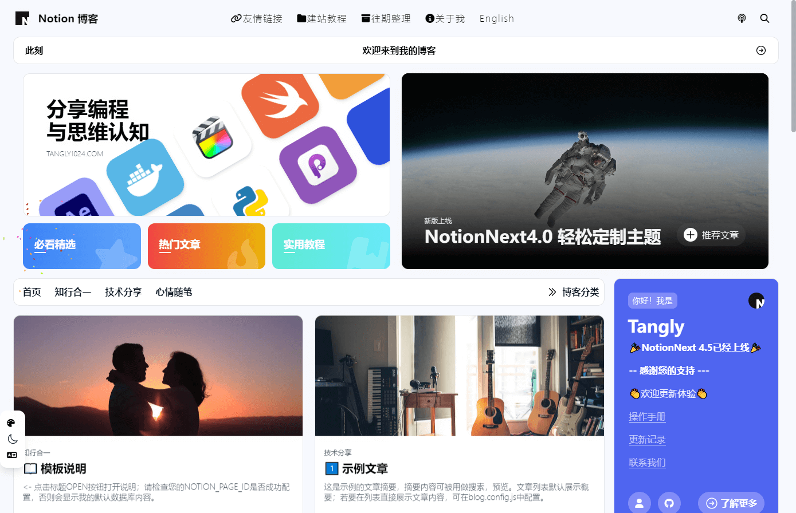
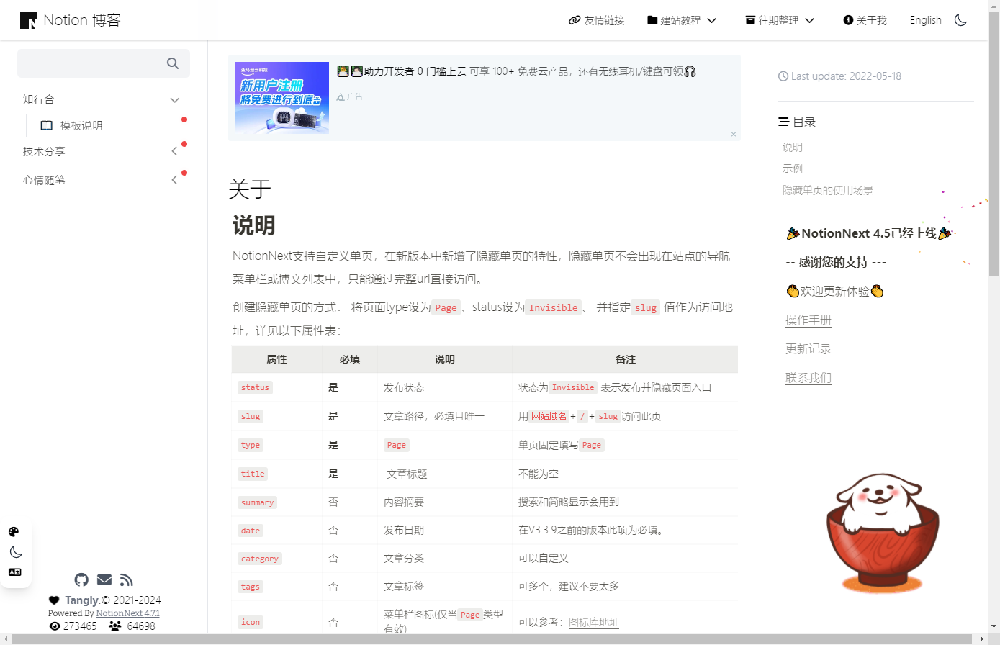
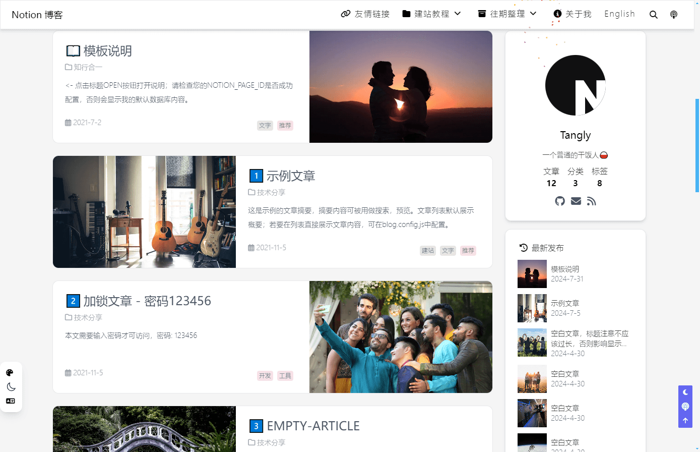
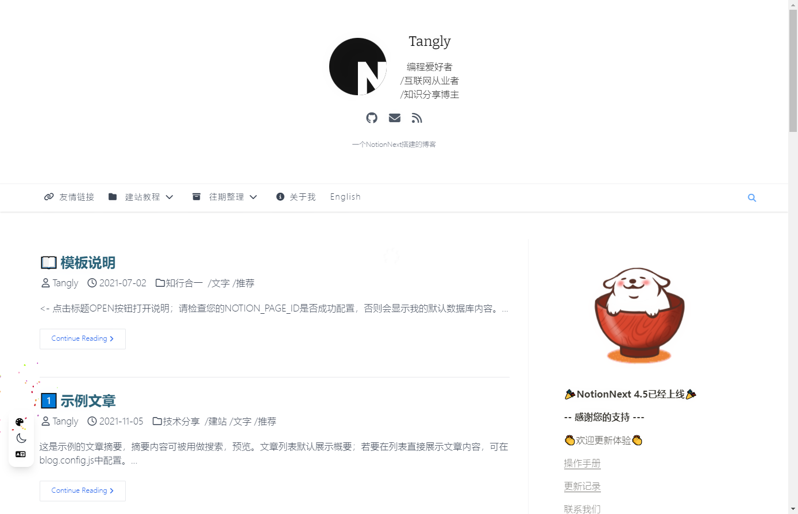
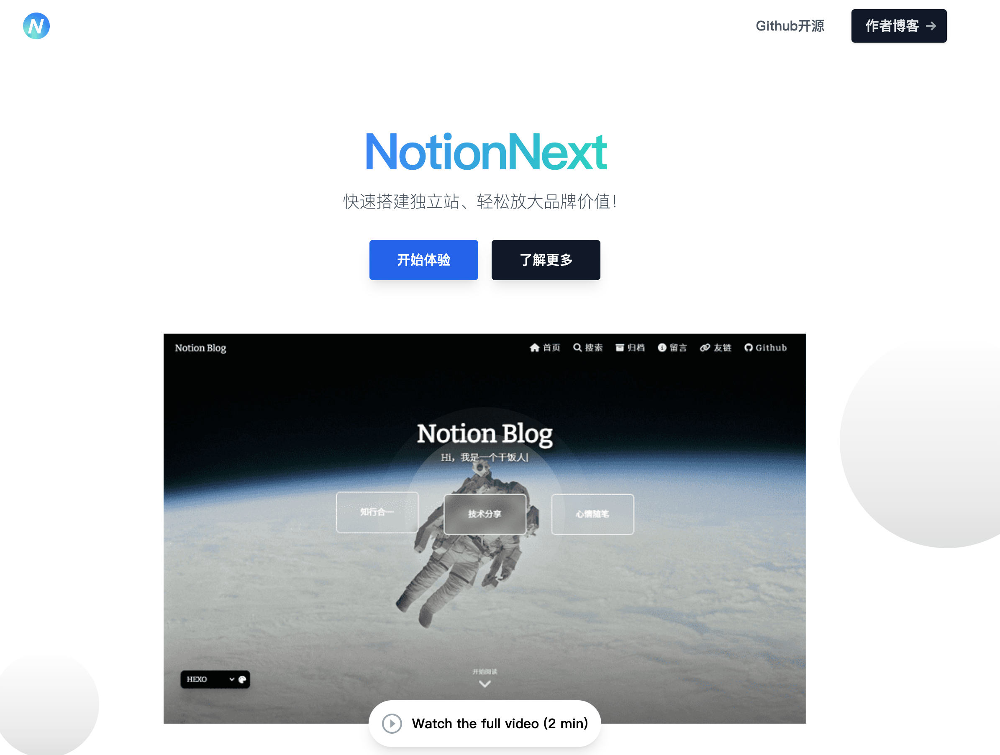
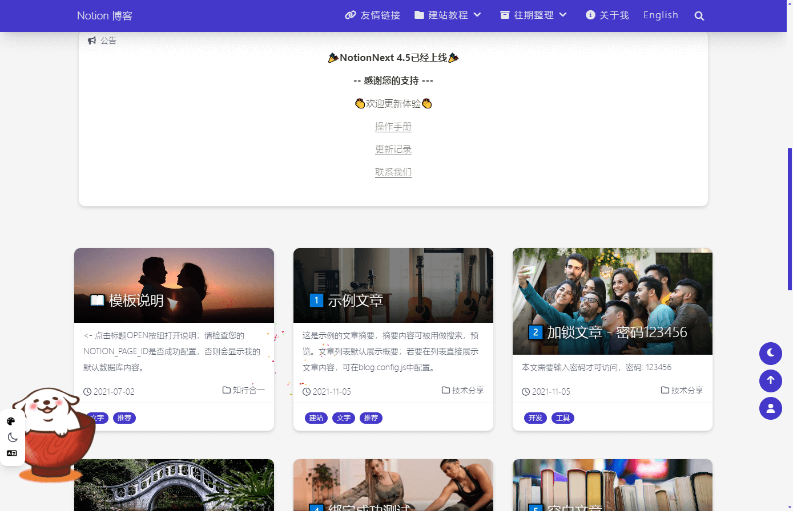
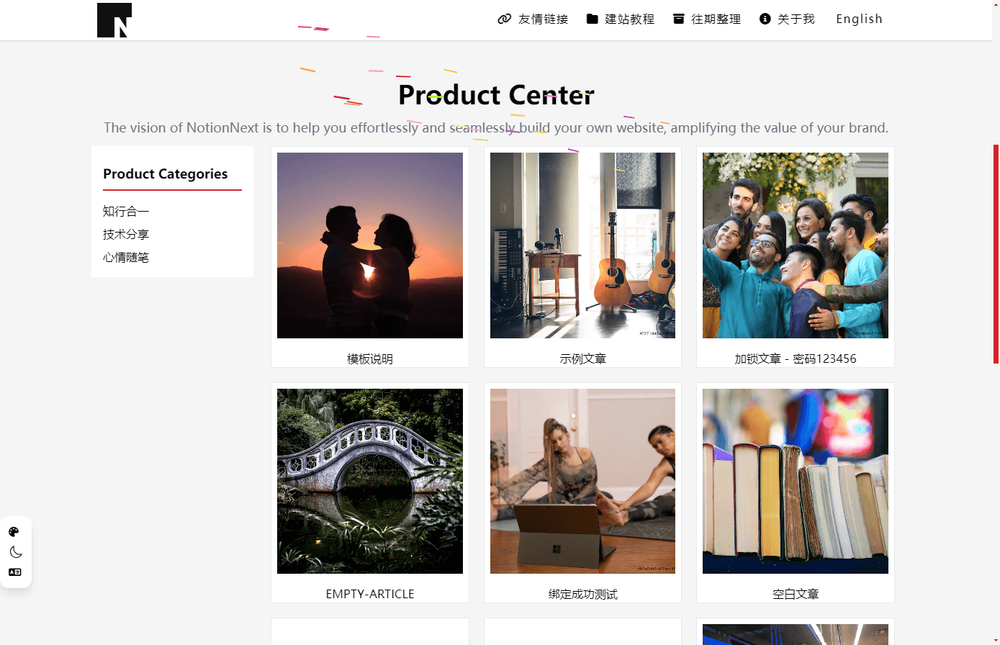

# FeiShow

在飞书写内容，发布成现代独立网站。

[在线演示](https://feishow.srint.cn/) · [最少步骤部署](./docs/deploy/feishu-minimal.md) · [GitHub 仓库](https://github.com/askofcc/FeiShow)

[](https://vercel.com/new/clone?repository-url=https://github.com/askofcc/FeiShow&env=FEISHU_APP_ID,FEISHU_APP_SECRET,FEISHU_SITE_ROOT&envDescription=App%20ID%2C%20Secret%2C%20wiki%20root%20URL&project-name=feishow&repository-name=FeiShow)

---

## 🎨 25+ 精美主题即刻开箱即用

飞书多维表格中一键热切换，无需重新构建部署：

| Heo（极客博客风） | GitBook（技术文档风） | Hexo（经典博客） |
| :---: | :---: | :---: |
|  |  |  |
| **Simple（极简笔记）** | **Fuwari（动效卡片）** | **Landing（产品落地页）** |
|  |  |  |
| **Medium（专栏杂志）** | **Matery（卡片流）** | **Commerce（微商店/展示）** |
|  |  |  |

---

## 为什么选择 FeiShow？

你已经在飞书里积累了大量文档、知识库和项目记录。但如果想对外公开成一个像样的网站（博客、产品官网、帮助中心、团队 Wiki），通常需要把内容手动搬运到 WordPress、Hexo、Notion 或维护一套复杂 CMS。

**FeiShow 让你直接把飞书当成网站的内容后台（CMS）：**

- 📝 **继续在飞书写作**：享受飞书出色的富文本、多维表格与协作体验，改完即自动同步。
- 🎨 **25+ 精美主题开箱即用**：博客风、文档站（GitBook/Hexo）、作品集、杂志风等，随时在飞书里一行切换。
- ⚡ **极简一站式维护**：全站只认一个飞书知识库根页，文档、栏目、多维表格、独立页面全自动发现。
- 🤖 **AI 原生就绪（AI-Ready）**：自带 `/llms.txt` 与标准 Agent API，将飞书复杂编辑态数据提纯为干净的 Markdown 与结构化 JSON。
- 🔍 **专业站点能力**：独立域名、SEO 优化、深色模式、多级目录（TOC）、文章搜索、RSS 订阅、Sitemap 生成全内置。

---

## 核心架构与原理：一站只认一个飞书根页

`FEISHU_SITE_ROOT` 是 FeiShow 的主链接，也是站点的唯一内容入口。它指向一个飞书知识库根页；根页下的内容表和文档构成站点，配置中心则由内容表按需引用。

```text
FEISHU_SITE_ROOT（只在建站时填一次）
  ├─ 内容表（多维表格） → 菜单、文章、页面、分类
  ├─ 飞书文档          → 实际正文内容
  └─ 可选：配置中心    → 单独的 CONFIG 表，按需管理站名、主题、SEO
```

**日常零后台负担**：不需要手抄 `table_id` 或文档 token，也不需要在部署平台反复改配置。日常内容增删与站点微调均在飞书内完成。

| 角色 | 第一次需要做什么 | 日常主要在哪里操作 |
|---|---|---|
| **普通访客 / 读者** | 直接访问独立域名浏览 | 独立站网页端 |
| **内容创作者 / 运营** | 不需要开发者权限与 API Secret | 飞书文档、内容表、CONFIG 表 |
| **站点部署者 / 开发者**| 填入根页链接与一次性凭证部署 | 托管平台（换根页或排障时才需要） |

---

## 用户操作指南：选择适合你的使用模式

FeiShow 根据用户场景分为三种操作深度：从**0 代码小白极简建站**，到**生产级稳定控制**，再到**开发者深度折腾**。

### 🌱 模式一：普通用户极简模式（克隆模板 + 公开凭证或公开可读）

适合不想折腾开放平台开发者后台、仅想在 1 分钟内极速体验建站的个人：

1. **克隆官方根页模板**：
   - 打开 [飞书官方页面模板](https://test-d2al261ggga5.feishu.cn/wiki/AHHowAmX9itAKWkHvWOcqQOPneg)（包含多维表格「内容」、示例文章与配置中心）。
   - 点击右上角「...」选择「复制页面」或克隆到自己的知识空间中，复制新生成的根页主链接（`FEISHU_SITE_ROOT`）。
2. **开箱即用：使用公开应用凭据**（免去手动创建与配置应用）：
   - `FEISHU_APP_ID`：`cli_aa0f2dc1f8f81beb`
   - `FEISHU_APP_SECRET`：`raTlSQRuA0Sr8oTRt5VJxe7X1vDkVZSg`
   - 在克隆后的知识库根页右上角点击「分享」→「添加文档应用 / 协作者」→ 搜索上述应用并授予 **「可阅读」** 权限。
3. **一键部署或交给 AI 助手**：
   - 将克隆后的主链接及上述凭据直接填入 Vercel 部署向导，或发给 AI 编程助手（如 Codex、ChatGPT 等）协助完成。

> 💡 **公开分享说明**：若不使用应用凭据，亦可在根页开启「互联网获得链接的人可阅读」（需勾选应用到所有子页面）。但官方 OpenAPI 配合应用授权通道速度更快、稳定性更高，且无需向公网公开源文档。

---

### 🚀 模式二：稳定精细控制模式（推荐生产使用：开通专属自建应用 / 智能体 + 精细只读权限）

适合正式个人站点、团队官网、产品文档站，或包含受控私有内容的场景：

1. **创建专属自建应用（智能体）**：
   - **快捷通道**：点击 [一键创建应用智能体快捷入口](https://open.feishu.cn/page/launcher?from=backend_oneclick) 快速开通；
   - **常规通道**：前往 [飞书开放平台 (open.feishu.cn)](https://open.feishu.cn/app) → 点击「创建企业自建应用」（可命名为你的站点机器人 / 智能体）。
2. **开通只读权限清单**（在开放平台「开发配置」→「权限管理」中添加，并**创建版本并发布**）：
   - `docx:document:readonly`（云文档 / 新版文档读取：拉取正文 blocks 与文档属性）
   - `wiki:wiki:readonly`（知识库读取：解析知识库节点树与子文档层级）
   - `bitable:app:readonly`（多维表格读取：查询内容表菜单/文章索引与 CONFIG 表）
   - `drive:drive:readonly`（云空间读取：下载正文图片、文档封面及附件素材）
3. **获取应用凭证**：
   - 在「凭证与基础信息」中复制 `App ID` (`FEISHU_APP_ID`) 与 `App Secret` (`FEISHU_APP_SECRET`)。
4. **知识库根页授权**：
   - 打开 `FEISHU_SITE_ROOT` 根页右上角「分享」→「添加文档应用」/「添加协作者」→ 搜索刚创建的应用名称 → 授予 **「可阅读」** 权限（子页面与表格自动继承）。

> ✅ **核心优势：**
> - **100% 官方 OpenAPI 稳定通道**：走官方鉴权接口，响应迅速稳定，不受公网网页防爬或会话策略干扰。
> - **数据安全私密**：无需将文档公开分享至公网，只有获得授权的应用凭证才能读取内容。

---

### 🛠️ 模式三：极客与开发者模式（深度折腾、无头 CMS、多主题与私有化）

针对有深度定制或集成需求的开发者：

- **自由热切换 25+ 主题**：直接在飞书 CONFIG 表改 `THEME`，或在 URL 上加 `?theme=gitbook`、`?theme=simple` 实时预览。
- **作为无头 CMS（Headless CMS）**：不使用自带前端，仅将 FeiShow 部署为数据服务，前端用自己的框架，调用 Agent API。
- **开发自定义主题**：基于清晰的 `THEME_DATA_CONTRACT.md` 开发新主题，主题层只消费结构化数据与 `<NotionPage />` 统一正文组件，无需编写一行飞书 API 代码。
- **Docker 私有化部署**：`docker compose up -d --build` 构建并运行生产 standalone 镜像。

---

## 快速部署（最少步骤）

完整图文说明见：[最少步骤部署指南](./docs/deploy/feishu-minimal.md)。首次部署只需下面这条路径：

1. **克隆飞书根页模板**：打开 [飞书页面模板](https://test-d2al261ggga5.feishu.cn/wiki/AHHowAmX9itAKWkHvWOcqQOPneg)，点击右上角「...」复制克隆到自己的知识空间中，获取新页面的主链接（`FEISHU_SITE_ROOT`）。
2. **准备应用凭证（二选一）**：
   - **极速体验（开箱即用）**：使用公开提供的应用凭据（无需手动创建应用）：
     - `FEISHU_APP_ID`: `cli_aa0f2dc1f8f81beb`
     - `FEISHU_APP_SECRET`: `raTlSQRuA0Sr8oTRt5VJxe7X1vDkVZSg`
   - **生产推荐（专属应用）**：点击 [一键创建应用智能体](https://open.feishu.cn/page/launcher?from=backend_oneclick) 获取专属 App ID / Secret。
3. **一键 Vercel 部署**，填入 **3 个环境变量**：

| 环境变量 | 填写内容 | 说明 / 默认示例 |
|---|---|---|
| `FEISHU_APP_ID` | 开放平台 App ID | 示例/公开凭据：`cli_aa0f2dc1f8f81beb`（或填专属 App ID） |
| `FEISHU_APP_SECRET` | 开放平台 App Secret | 示例/公开凭据：`raTlSQRuA0Sr8oTRt5VJxe7X1vDkVZSg`（或填专属 Secret） |
| `FEISHU_SITE_ROOT` | 飞书根页链接 | 克隆后的知识库根页链接，形如 `https://xxx.feishu.cn/wiki/xxxxxxxx` |

[](https://vercel.com/new/clone?repository-url=https://github.com/askofcc/FeiShow&env=FEISHU_APP_ID,FEISHU_APP_SECRET,FEISHU_SITE_ROOT&envDescription=App%20ID%2C%20Secret%2C%20wiki%20root%20URL&project-name=feishow&repository-name=FeiShow)

4. **根页授权**：在克隆后的飞书根页右上角点击「分享」→「添加文档应用 / 协作者」，添加对应应用并授予 **「可阅读」** 权限。
5. **自检验证**：部署完成后打开健康检查确认连接状态：`https://你的域名/api/feishu/health`。

> 💡 **小贴士**：仓库若是私有的，请先 Fork 到自己的 GitHub 账号，再导入 Vercel 部署。

---

## 日常管理：全部在飞书里完成

部署完成后，日常运维与内容更新不需要回到 Vercel：

| 想做的事 | 去哪里改 | 是否需要重新部署 |
|---|---|---|
| 新增 / 修改文章、页面、菜单、分类 | 飞书多维表格「内容」与对应文档 | 否，自动同步 |
| 改站点标题、描述、主题、语言、横幅、SEO | 飞书多维表格「CONFIG」 | 否，等缓存刷新即可 |
| 换整套内容源或换知识空间 | 托管平台改 `FEISHU_SITE_ROOT` | 是，重新部署 |
| 修复读不到内容、权限报错 | 飞书开放平台权限与根页分享设置 | 通常不需要改代码 |

### 快速定制站点外观（CONFIG 表常用 4 项）

在 CONFIG 表中新增以下行并勾选「启用」即可生效：

| 配置名 | 配置值示例 | 效果 |
|---|---|---|
| `TITLE` | `我的技术空间` | 浏览器标签页标题、站点名称 |
| `DESCRIPTION` | `专注分享工程实践与深度思考` | 首页副标题与 SEO 描述 |
| `LINK` | `https://your-domain.com` | Sitemap、RSS 与社交分享的站点基准 URL |
| `THEME` | `example` (或 `simple`, `gitbook`, `heo`) | 站点主题风格 |

完整配置项清单详见：[CONFIG 表说明](./docs/feishu/FEISHU_BITABLE_CONFIG_CONTRACT.md)。

---

## 项目核心价值：飞书数据结构化与 AI 就绪度（AI-Ready）

### 1. 为什么飞书官方 API 不能直接拿来做公开展示？

官方飞书云文档 API 返回的是深度嵌套的**编辑态 JSON**（包含大量协同标记、权限位、原始 blockType、样式 runs 与复杂关系），这是为内部在线协作编辑设计的，直接拿来做 Web 渲染或传给 AI 时存在严重痛点：
- 数据冗余度极高，单篇文档 JSON 体积大、嵌套深；
- 没有线性的标题层级、目录锚点与图文排版语义；
- 机器和外部大模型根本无法稳定阅读与解析。

### 2. FeiShow 的核心提纯工作

FeiShow 专注于**展示场景的数据清洗与结构化重组**：
```text
飞书原始编辑态 JSON (blocks / drive / bitable)
        ↓ 
[FeiShow 结构化引擎] 字段清洗、图片代理、目录提取、Markdown 提纯
        ↓
标准展示层 (Post / BasePage)  +  标准 Agent API (/api/agent/*)  +  AI 爬虫规范 (/llms.txt)
```

### 3. 开箱即用的 AI / Agent 数据出口

FeiShow 不仅仅是一个博客站点，也是一个**面向 AI Agent、RAG 知识库与外部应用的无头数据源**。你可以直接取用处理好的纯净数据：

| 需求场景 | 调用方式 / 访问路径 | 返回格式 |
|---|---|---|
| **全站文章索引** | `GET /api/agent/posts` | 结构化 JSON 列表（含标题、slug、摘要、分类、标签、更新时间） |
| **单篇结构化数据** | `GET /api/agent/posts/<slug>` | 单篇完整对象（含目录 TOC、元属性、正文块树） |
| **单篇干净 Markdown** | `GET /api/agent/posts/<slug>?format=md` | 纯净 Markdown，可直接用于 RAG 切片或 Prompt 上下文注入 |
| **大模型站点地图** | `GET /llms.txt` | 符合 LLMs 标准的全站纯文本内容索引（供 ChatGPT / Claude / 爬虫阅读） |

```bash
# 获取全站文章索引
curl -sS https://你的域名/api/agent/posts

# 获取单篇干净 Markdown
curl -sS "https://你的域名/api/agent/posts/<slug>?format=md"
```

完整接口规范与字段定义详见：[Agent API 规范说明](./docs/feishu/AGENT_API.md)。

---

## 本地开发与 Docker 自托管

### 本地运行

```bash
git clone https://github.com/askofcc/FeiShow.git
cd FeiShow
npx yarn@1.22.22 install
cp .env.feishu.example .env.local
# 填写 FEISHU_APP_ID / FEISHU_APP_SECRET / FEISHU_SITE_ROOT
npx yarn@1.22.22 dev -p 3460
```

### Docker 一键部署

默认 `docker compose` 构建生产 standalone 镜像，不要用开发挂载当正式部署。

```bash
# 准备环境文件并填写飞书三项变量
cp .env.feishu.example .env.docker.local
docker compose up -d --build
```

开发热更新：

```bash
docker compose -f docker-compose.dev.yml up
```

如果本机 Docker Desktop 磁盘涨得很快，先清掉旧构建缓存再部署：

```bash
docker builder prune -f
docker image prune -f
```

生产服务器不要在每次发布后无限保留 BuildKit 缓存。上面的 `docker builder prune -f`
只清理未使用的构建缓存，不会删除正在运行的容器或当前使用的镜像；也可以按需只保留最近
7 天的缓存：

```bash
docker builder prune --filter until=168h
```

生产 standalone 容器不挂载 `.next`、`node_modules` 或 Yarn 缓存，运行时 Feishu 数据缓存默认
使用进程内存（配置 `REDIS_URL` 时使用 Redis）。因此运行中的容器不会因为正常访问持续累积本地
文件。Docker 磁盘长期增长通常来自反复 `--build` 留下的 BuildKit 缓存、旧镜像，或宿主机日志；
Compose 已为应用日志设置 `10MB x 3` 的轮转上限。

---

## 常见排障与健康检查

部署遇到问题时，优先访问健康自检端点：`https://你的域名/api/feishu/health`

| 检查项报错 | 最常见原因 | 解决方法 |
|---|---|---|
| **应用鉴权失败** | App ID/Secret 不匹配，或权限未发布 | 前往开放平台核对凭据，并确认权限已「创建版本并发布」 |
| **根页无法读取** | 应用未添加至知识库协作者 | 飞书根页右上角「分享」→ 添加文档应用为「可阅读」 |
| **内容表未找到** | 根页下缺少包含「标题/类型/文档」列的多维表格 | 检查多维表格列名，并确认应用有权读取该表格 |
| **CONFIG 表未找到** | 未建配置表（不影响正常建站） | 如需个性化配置再建表，并在内容表新增「类型=配置」记录引用它 |

---

## 进阶文档导航

| 需求 | 参考文档 |
|---|---|
| 深入理解全站配置优先级 | [配置来源与环境变量划分](./docs/feishu/CONFIG_SOURCES.md) |
| 多维表格字段详细契约 | [内容表契约说明](./docs/feishu/FEISHU_CONTENT_TABLE_CONTRACT.md) |
| 配置中心高级开关指南 | [CONFIG 表完整字段文档](./docs/feishu/FEISHU_BITABLE_CONFIG_CONTRACT.md) |
| 开发与定制新前端主题 | [主题数据开发契约 (THEME_DATA_CONTRACT)](./docs/feishu/THEME_DATA_CONTRACT.md) |
| 单篇文档契约与权限 | [文档调用与权限契约](./docs/feishu/FEISHU_DOCUMENT_CONTRACT.md) |

---

## 致谢与开源协议

- 前端界面与多主题系统大量衍生自优秀的开源项目 [NotionNext](https://github.com/notionnext-org/NotionNext)（MIT 许可）。
- 感谢原作者 [tangly1024](https://github.com/tangly1024) 及社区贡献者。
- 本项目遵循 [MIT 许可证](./LICENSE)，第三方依赖与引用说明见 [NOTICE](./NOTICE)。
- 本项目非 NotionNext 官方分支，问题与 PR 请提交至 [askofcc/FeiShow](https://github.com/askofcc/FeiShow)。
